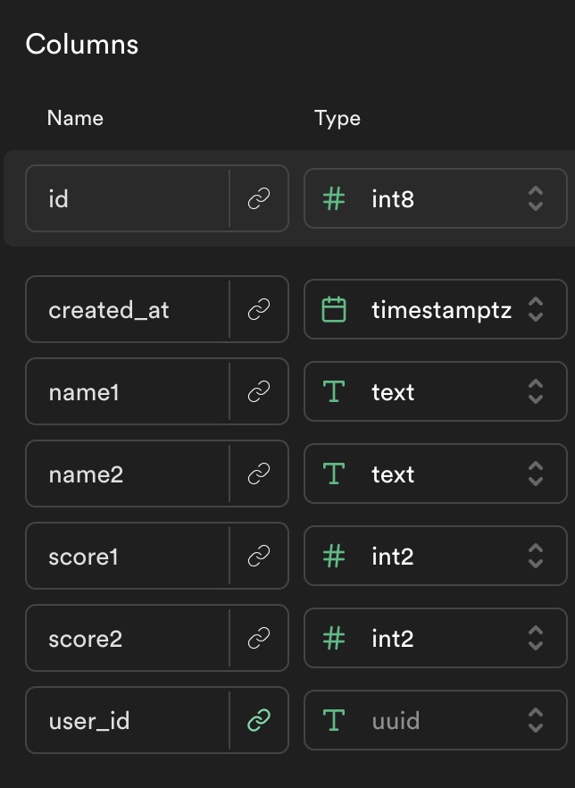

# Supabase Soccer Scorekeeper

## Learning Objectives

- Create an object containing complex values (objects or arrays) and access any item in that complex object using dot and bracket notation
- Display errors to users with an alert inside a .catch block
- In response to a user event, make a fetch call add a new object to the database and display the new state to the user.

[Buggy Supabase Soccer Scorekeeper](https://github.com/alchemycodelab/buggy-js-soccer-scorekeeper-supabase)

Here is the model for the `games` table

### Live Example

<https://alchemycodelab.github.io/web-01-soccer-scorekeeper-supabase/>

| User should be able to . . .                                                         |             |
| :----------------------------------------------------------------------------------- | ----------: |
| Visit the deployed pages on GitHub pages, with link in the About section of the Github repo|        .5 |

| Events  `                                                                            |             |
| :----------------------------------------------------------------------------------- | ----------: |
| On the home page (`'/'`), Login and Signup using the login and signup form. On success, redirect to the `/games` page   |        .5 |
| Logout by clicking the logout button                                                       |        .5 |
| If a non-logged-in user tries to visit the games page, redirect them to the login page | .5 |
| On the games page load, see a form and empty current game div                              |        1 |
| On the games page load, fetch all past games and render them to the past games div         |        1 |
| On submit, add the team names to the current game div                                      |        .5 |
| On clicking add or subtract, increment and decrement the correct score in the current game div|     .5 |
| On clicking finish, empty the current game div, and use supabase to add the current game to the database. |1|
| On clicking finish, clear the past games div, then fetch all past games from supabase and render them in the past games div. |1|

| Functions                                                              |             |
| :----------------------------------------------------------------------------------- | ----------: |
| IMPURE: `displayCurrentGameEl()` : displays the form state to the current game DOM element | .5|
| IMPURE: `displayAllGames()` : clears out and appends to games div | .5|
| PURE with TDD: `renderGame(game)` : returns DOM node | .5|
| PURE with TDD: `renderTeam(name, score)` :  return DOM node | .5|
| ASYNC: `createGame(game)` : creates a game for currently logged in user in supabase |.5|
| ASYNC: `getGames()` : returns games for currently logged in user from supabase |.5|
